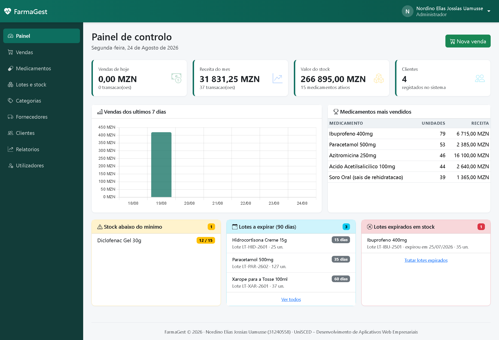

# FarmaGest — Sistema de Gestão de Farmácia

Aplicação Web para a gestão integrada de uma farmácia: catálogo de medicamentos,
controlo de existências **por lote**, registo de vendas com **abate automático de
stock segundo o critério FEFO** e relatórios de apoio à decisão.

Desenvolvida de raiz em **PHP 8.2** sobre uma arquitectura **MVC própria**, sem
recurso a frameworks, com base de dados **MySQL/MariaDB** e interface responsiva
em **Bootstrap 5**.

> Trabalho académico — UniSCED, Desenvolvimento de Aplicativos Web Empresariais
> **Nordino Elias Jossias Uamusse** (31240558) · Moçambique, 2026

---

## Demonstração

| | |
|---|---|
| Vídeo | [`docs/FarmaGest-demonstracao.mp4`](docs/FarmaGest-demonstracao.mp4) — 88 s |
| Relatório | [`docs/Relatorio FarmaGest.docx`](docs/Relatorio%20FarmaGest.docx) — 27 páginas |
| Capturas | [`docs/imagens/ecras/`](docs/imagens/ecras) |
| Diagramas UML | [`docs/imagens/`](docs/imagens) — casos de uso, classes, sequência |



---

## A regra central: FEFO

Na gestão de armazéns convencional usa-se FIFO — sai primeiro o que entrou
primeiro. O medicamento não obedece a essa lógica: dois lotes recebidos com uma
semana de intervalo podem ter validades separadas por anos.

O FarmaGest aplica **FEFO — First Expired, First Out**: consome-se sempre o lote
cuja validade está mais próxima. É por isso que o stock **vive nos lotes e nunca
no medicamento** — só o lote tem data de validade.

```sql
SELECT id, numero_lote, quantidade_atual
  FROM lotes
 WHERE medicamento_id = :id
   AND quantidade_atual > 0
   AND data_validade  >= CURDATE()
 ORDER BY data_validade ASC, id ASC
   FOR UPDATE
```

A cláusula `FOR UPDATE` é indispensável: sem ela, duas vendas simultâneas do
mesmo medicamento leriam o mesmo lote com a mesma quantidade disponível e ambas
concluiriam que havia stock suficiente, resultando em stock negativo. Toda a
operação decorre dentro de uma transacção — qualquer excepção reverte tudo.

A venda de uma única quantidade pode originar **várias linhas** em `itens_venda`,
uma por cada lote consumido. É o que garante a rastreabilidade completa: para
qualquer venda sabe-se de que lote saiu cada unidade.

---

## Funcionalidades

- **Autenticação e perfis** — administrador, farmacêutico e operador de caixa,
  com controlo de acesso centralizado no encaminhador
- **Catálogo** — medicamentos, categorias e fornecedores, com pesquisa e filtros
- **Existências por lote** — entradas de mercadoria, ajustes manuais com motivo
  obrigatório, alertas de stock mínimo, de lotes expirados e a expirar
- **Vendas** — carrinho com totais em tempo real, abate FEFO, recibo imprimível
  e anulação com reposição integral do stock
- **Clientes** — carteira e histórico de compras
- **Relatórios** — vendas por período (por forma de pagamento e por operador),
  existências e movimentos de stock
- **Auditoria** — nenhuma venda é apagada; todo o movimento de stock fica
  registado com autor, data e motivo

---

## Requisitos

- PHP 8.1 ou superior, com as extensões `pdo_mysql` e `mbstring`
- MySQL 5.7 / MariaDB 10.3 ou superior
- Opcionalmente XAMPP, que já inclui ambos

Não há dependências de terceiros a instalar: o Bootstrap, o Bootstrap Icons e o
Chart.js estão incluídos em `public/assets/vendor/`, pelo que a aplicação
funciona sem ligação à Internet.

---

## Instalação

```bash
# 1. Criar a base de dados e as tabelas
mysql -u root < database/schema.sql

# 2. Carregar os dados iniciais (utilizadores, catálogo, lotes)
mysql -u root farmagest < database/seed.sql

# 3. (Opcional) Gerar histórico de vendas de demonstração
php database/seed_vendas.php
```

Copie `.env.example` para `.env` e ajuste as credenciais:

```ini
APP_ENV=desenvolvimento
APP_DEBUG=1

DB_HOST=127.0.0.1
DB_PORT=3306
DB_NAME=farmagest
DB_USER=root
DB_PASS=
```

### Executar

**Servidor embutido do PHP:**

```bash
php -S localhost:8000 -t public public/router.php
```

**XAMPP** — coloque o projecto em `htdocs` e abra `http://localhost/farmagest/`.
O `.htaccess` da raiz encaminha os pedidos para `public/`, pelo que não é
necessário incluir `/public` no endereço.

As três formas de instalação são suportadas em simultâneo:

| Endereço | Modo |
|---|---|
| `http://localhost:8000/` | Servidor embutido do PHP |
| `http://localhost/farmagest/` | XAMPP, endereços limpos |
| `http://localhost/farmagest/public/` | XAMPP, sem reescrita de URLs |

Em produção, aponte a raiz do servidor Web directamente para `public/` e defina
`APP_ENV=producao` e `APP_DEBUG=0`.

### Contas de demonstração

| Perfil | E-mail | Palavra-passe |
|---|---|---|
| Administrador | `admin@farmagest.co.mz` | `Admin@123` |
| Farmacêutico | `farmaceutico@farmagest.co.mz` | `Farm@123` |
| Operador de caixa | `caixa@farmagest.co.mz` | `Caixa@123` |

> Contas de demonstração. Elimine-as ou altere as palavras-passe antes de
> qualquer utilização real.

---

## Testes

```bash
# 48 asserções sobre a lógica de negócio, executadas contra a base de dados
php tests/executar.php

# 50 rotas verificadas por HTTP, com sessão autenticada
powershell -File tests/crawl.ps1
powershell -File tests/crawl.ps1 -Base http://localhost/farmagest
```

Os testes de negócio repõem o estado da base de dados no fim, pelo que podem
correr repetidamente sem efeitos colaterais.

---

## Estrutura

```
app/
  Core/          Router, Model, Database, Auth, Session, Csrf,
                 Validator, Request, ErrorHandler, Url, helpers
  Models/        Medicamento, Lote, Venda, MovimentoStock,
                 Categoria, Fornecedor, Cliente, Utilizador
  Controllers/   um controlador por módulo funcional
  Views/         vistas por módulo + layouts
config/          config.php (definições) e routes.php (rotas)
database/        schema.sql, seed.sql, seed_vendas.php
public/          index.php, .htaccess, assets/ (css, js, vendor)
tests/           executar.php e crawl.ps1
tools/           geração de diagramas, capturas, relatório e vídeo
docs/            diagramas, capturas, relatório e vídeo
```

Apenas `public/` deve ficar exposta ao servidor Web. Todo o restante código fica
fora da raiz pública, inacessível por HTTP directo.

---

## Segurança

- **Injecção de SQL** — consultas parametrizadas com PDO e emulação de
  preparação desactivada; identificadores validados contra listas ou expressões
  regulares restritivas
- **XSS** — toda a saída é escapada
- **CSRF** — token por sessão em todos os pedidos que não sejam GET, com
  comparação em tempo constante
- **Palavras-passe** — cifradas com bcrypt
- **Força bruta** — bloqueio após cinco tentativas falhadas, durante 5 minutos
- **Sessões** — identificador regenerado na autenticação; cookies `HttpOnly` e
  `SameSite=Lax`; a conta é reconfirmada como activa a cada pedido
- **Integridade** — restrições `CHECK` no próprio esquema, que nenhum defeito da
  aplicação consegue contornar

---

## Ferramentas de apoio

```bash
powershell -File tools/render-diagramas.ps1    # SVG -> PNG dos diagramas UML
powershell -File tools/capturar-ecras.ps1      # capturas da aplicação
powershell -File tools/publicar-xampp.ps1      # sincroniza para o htdocs
python tools/gerar-relatorio.py                # relatório em Word
python tools/gerar-video.py                    # vídeo de demonstração
```

---

## Licença

Trabalho académico, disponibilizado para fins de estudo e avaliação.
